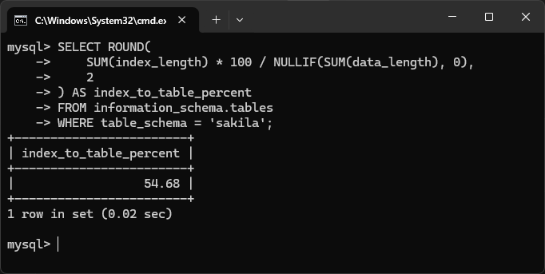
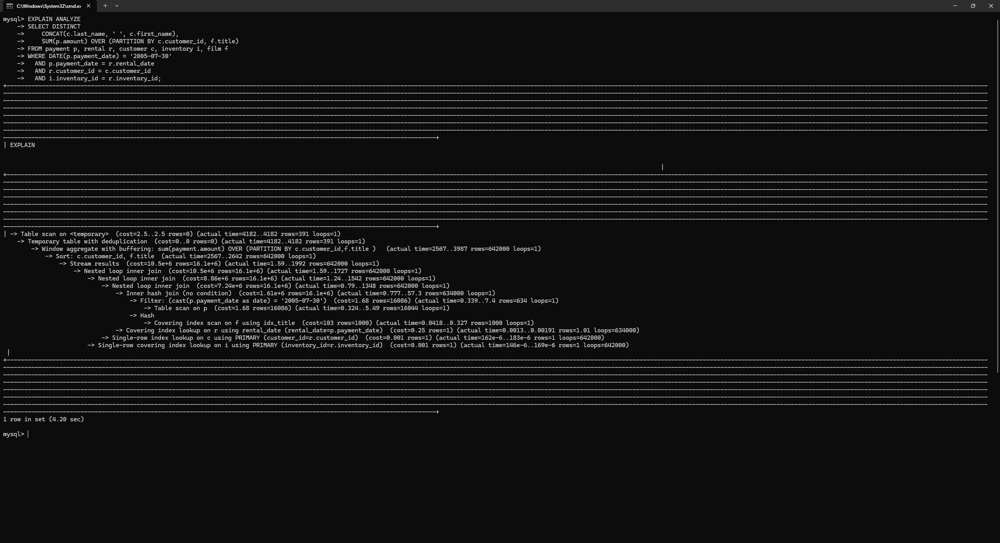
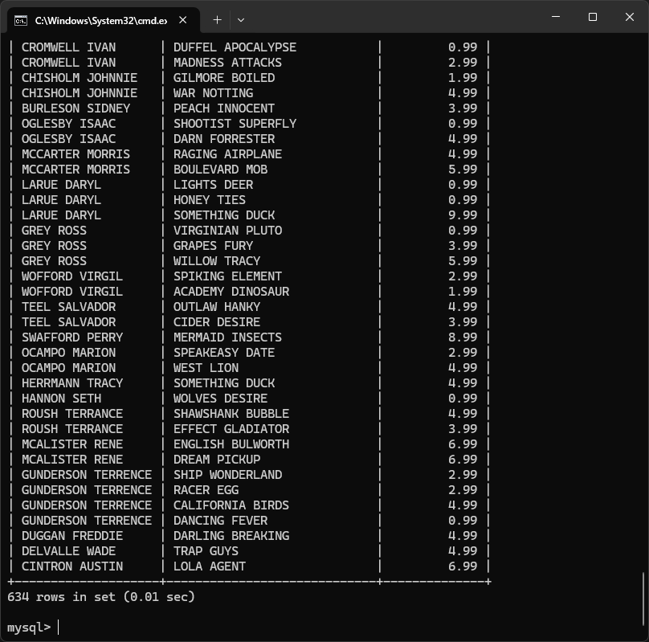
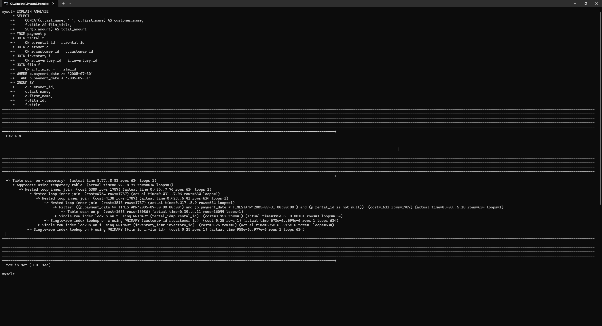

### Задание 1

Напишите запрос к учебной базе данных, который вернёт процентное отношение общего размера всех индексов к общему размеру всех таблиц.

**Ответ**



SQL-script:
```
SELECT ROUND(
    SUM(index_length) * 100 / NULLIF(SUM(data_length), 0),
    2
) AS index_to_table_percent
FROM information_schema.tables
WHERE table_schema = 'sakila';
```

---

### Задание 2

Выполните explain analyze следующего запроса:
```sql
select distinct concat(c.last_name, ' ', c.first_name), sum(p.amount) over (partition by c.customer_id, f.title)
from payment p, rental r, customer c, inventory i, film f
where date(p.payment_date) = '2005-07-30' and p.payment_date = r.rental_date and r.customer_id = c.customer_id and i.inventory_id = r.inventory_id
```
- перечислите узкие места;
- оптимизируйте запрос: внесите корректировки по использованию операторов, при необходимости добавьте индексы.

**Ответ**



Узкие места исходного запроса:

### 1. Неявные JOIN через запятую

`FROM payment p, rental r, customer c, inventory i, film f`

Это старый стиль записи. Он хуже читается и в таких запросах легко пропустить условие соединения.

### 2. Нет связи с таблицей film

В запросе таблица `film f` указана, но с остальными таблицами не связана.

Не хватает условия:

`i.film_id = f.film_id`

Из-за этого получается декартово произведение с `film`, то есть каждая подходящая строка размножается на все фильмы. Это главное узкое место и логическая ошибка запроса.

### 3. Используется DATE(p.payment_date)

`WHERE DATE(p.payment_date) = '2005-07-30'`

Так делать плохо, потому что функция `DATE()` применяется к столбцу, и MySQL обычно не может нормально использовать индекс по `payment_date`.

Гораздо лучше писать диапазон:

`p.payment_date >= '2005-07-30' AND p.payment_date < '2005-07-31'`

### 4. Неправильное соединение payment и rental

Сейчас:

`p.payment_date = r.rental_date`

Из-за этого:

- соединение идёт не по ключам;
- сравниваются даты-времена, что ненадёжно;
- в sakila для связи есть нормальный ключ — `rental_id`.

Правильно соединять так:

`p.rental_id = r.rental_id`

### 5. DISTINCT + оконная функция

`SELECT DISTINCT ..., SUM(...) OVER (...)`

Такой вариант заставляет MySQL делать лишнюю обработку: сначала считать окно, потом устранять дубликаты.

Для этой задачи здесь обычно проще и быстрее использовать обычный `GROUP BY`.

### 6. В PARTITION BY есть f.title, но сам title не выводится

Это логически странно:

`SUM(p.amount) OVER (PARTITION BY c.customer_id, f.title)`

То есть сумма считается по клиенту и фильму, но название фильма не выводится.

Результат получается неочевидный.

### Оптимизированный запрос:

Нормальный вариант — переписать через явные `JOIN` и `GROUP BY`.

SQL-script:

```
SELECT
    CONCAT(c.last_name, ' ', c.first_name) AS customer_name,
    f.title AS film_title,
    SUM(p.amount) AS total_amount
FROM payment p
JOIN rental r
    ON p.rental_id = r.rental_id
JOIN customer c
    ON r.customer_id = c.customer_id
JOIN inventory i
    ON r.inventory_id = i.inventory_id
JOIN film f
    ON i.film_id = f.film_id
WHERE p.payment_date >= '2005-07-30'
  AND p.payment_date < '2005-07-31'
GROUP BY
    c.customer_id,
    c.last_name,
    c.first_name,
    f.film_id,
    f.title;
```




```
EXPLAIN ANALYZE
SELECT
    CONCAT(c.last_name, ' ', c.first_name) AS customer_name,
    f.title AS film_title,
    SUM(p.amount) AS total_amount
FROM payment p
JOIN rental r
    ON p.rental_id = r.rental_id
JOIN customer c
    ON r.customer_id = c.customer_id
JOIN inventory i
    ON r.inventory_id = i.inventory_id
JOIN film f
    ON i.film_id = f.film_id
WHERE p.payment_date >= '2005-07-30'
  AND p.payment_date < '2005-07-31'
GROUP BY
    c.customer_id,
    c.last_name,
    c.first_name,
    f.film_id,
    f.title;
```



---

### Задание 3*

Самостоятельно изучите, какие типы индексов используются в PostgreSQL. Перечислите те индексы, которые используются в PostgreSQL, а в MySQL — нет.

*Приведите ответ в свободной форме.*

**Ответ**

Для PostgreSQL в актуальной документации перечислены такие методы индексации: B-tree, Hash, GiST, SP-GiST, GIN, BRIN, а также отдельно упомянуто расширение bloom. В MySQL в INDEX_TYPE фигурируют BTREE, FULLTEXT, HASH, RTREE. 

Суть этих типов:

 - **GiST** — обобщённое сбалансированное дерево поиска. Это каркас для сложных поисковых схем; документация PostgreSQL прямо пишет, что через GiST могут быть реализованы B-tree, R-tree и другие схемы индексации. Часто используется для геоданных, диапазонов, nearest-neighbor и похожих задач. В MySQL отдельного типа GIST нет.

- **SP-GiST** — вариант GiST для данных, которые естественно разбиваются по пространству на непересекающиеся области; это отдельный метод индексации PostgreSQL. В перечне типов MySQL такого метода нет.

 - **GIN** — Generalized Inverted Index, то есть обобщённый инвертированный индекс. В PostgreSQL он применяется там, где одно значение строки может соответствовать множеству ключей, например массивы, jsonb, полнотекстовый поиск. 
В MySQL отдельного типа GIN нет; там для полнотекстового поиска используется тип FULLTEXT.

 - **BRIN** — Block Range Index, компактный индекс по диапазонам блоков. Полезен для очень больших таблиц, где значения в целом коррелируют с физическим порядком строк. В MySQL отдельного типа BRIN нет.