### Задание 1
1.1. Поднимите чистый инстанс MySQL версии 8.0+. Можно использовать локальный сервер или контейнер Docker.

1.2. Создайте учётную запись sys_temp. 

1.3. Выполните запрос на получение списка пользователей в базе данных. (скриншот)

1.4. Дайте все права для пользователя sys_temp. 

1.5. Выполните запрос на получение списка прав для пользователя sys_temp. (скриншот)

1.6. Переподключитесь к базе данных от имени sys_temp.

Для смены типа аутентификации с sha2 используйте запрос: 
```sql
ALTER USER 'sys_test'@'localhost' IDENTIFIED WITH mysql_native_password BY 'password';
```
1.7. По ссылке https://downloads.mysql.com/docs/sakila-db.zip скачайте дамп базы данных.

1.8. Восстановите дамп в базу данных.

1.9. При работе в IDE сформируйте ER-диаграмму получившейся базы данных. При работе в командной строке используйте команду для получения всех таблиц базы данных. (скриншот)

*Результатом работы должны быть скриншоты обозначенных заданий, а также простыня со всеми запросами.*

**Ответ:**

1.2. Создайте учётную запись sys_temp. 

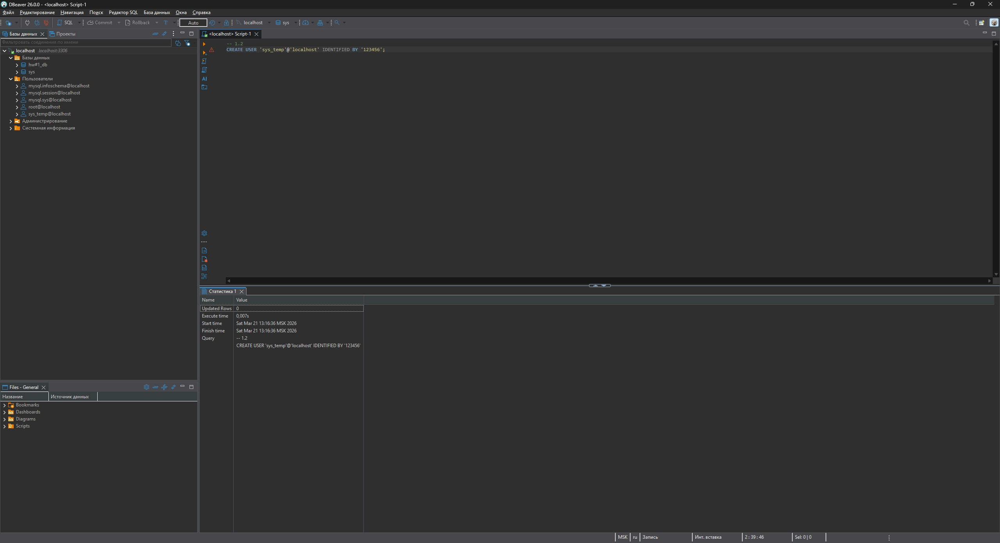

1.3. Выполните запрос на получение списка пользователей в базе данных.

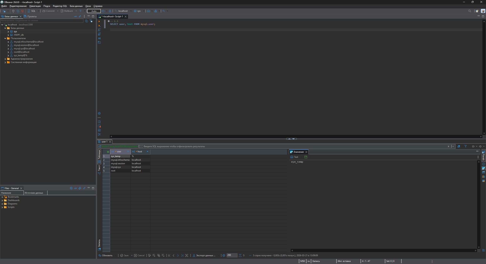

1.4. & 1.5. Дайте все права для пользователя sys_temp. Выполните запрос на получение списка прав для пользователя sys_temp.

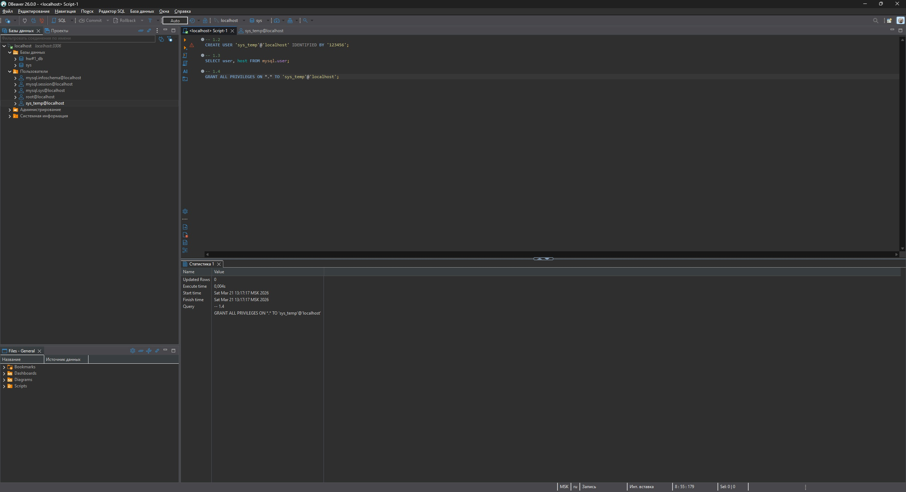
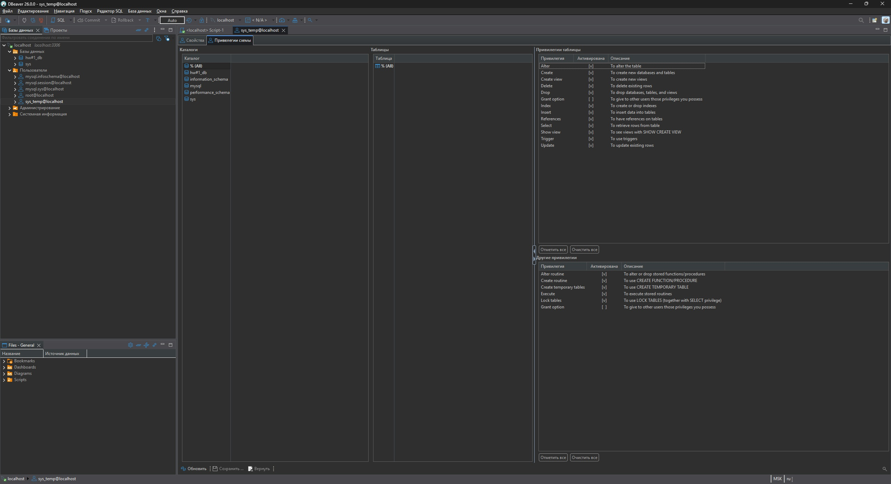
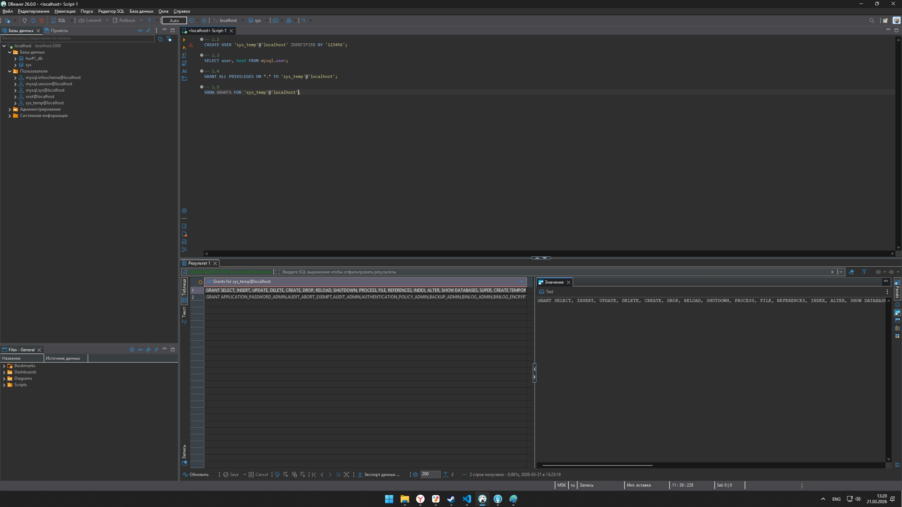

1.6. Переподключитесь к базе данных от имени sys_temp.

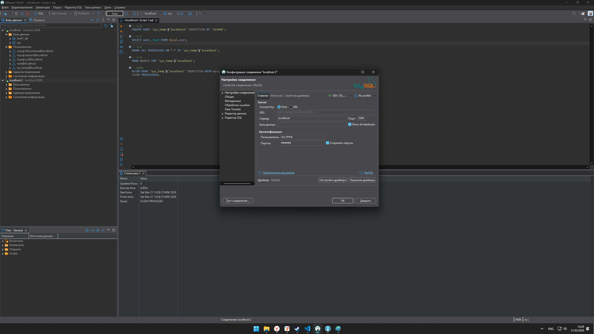

1.8. Восстановите дамп в базу данных.

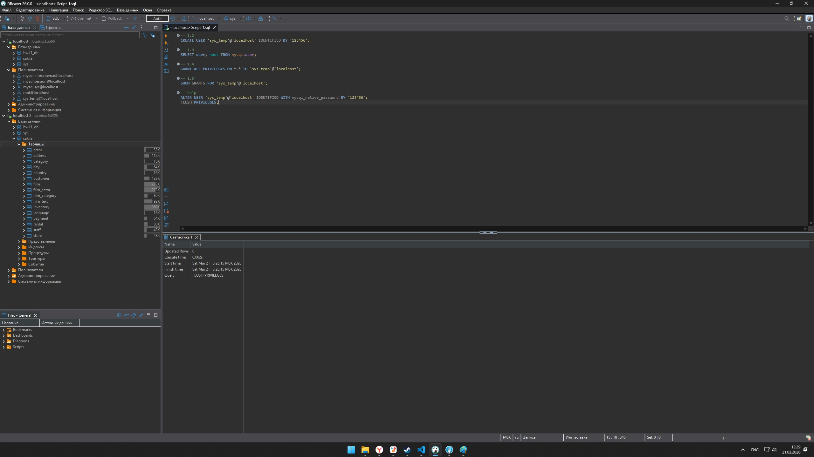

1.9. При работе в IDE сформируйте ER-диаграмму получившейся базы данных. При работе в командной строке используйте команду для получения всех таблиц базы данных. (скриншот)

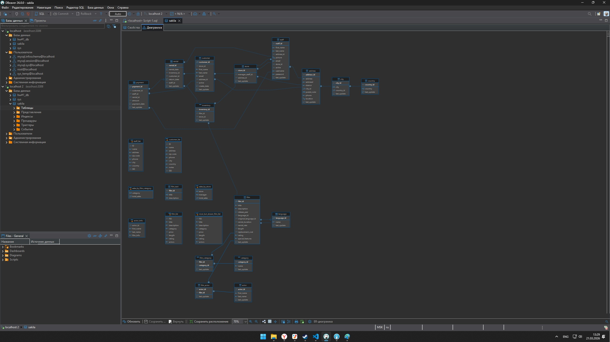

SQL-script:
```
-- 1.2
CREATE USER 'sys_temp'@'localhost' IDENTIFIED BY '123456';
-- 1.3 
SELECT user, host FROM mysql.user;
-- 1.4
GRANT ALL PRIVILEGES ON *.* TO 'sys_temp'@'localhost';
-- 1.5
SHOW GRANTS FOR 'sys_temp'@'localhost';
-- help
ALTER USER 'sys_temp'@'localhost' IDENTIFIED WITH mysql_native_password BY '123456';
FLUSH PRIVILEGES;
```

---

### Задание 2
Составьте таблицу, используя любой текстовый редактор или Excel, в которой должно быть два столбца: в первом должны быть названия таблиц восстановленной базы, во втором названия первичных ключей этих таблиц. Пример: (скриншот/текст)
```
Название таблицы | Название первичного ключа
customer         | customer_id
```

**Ответ:**

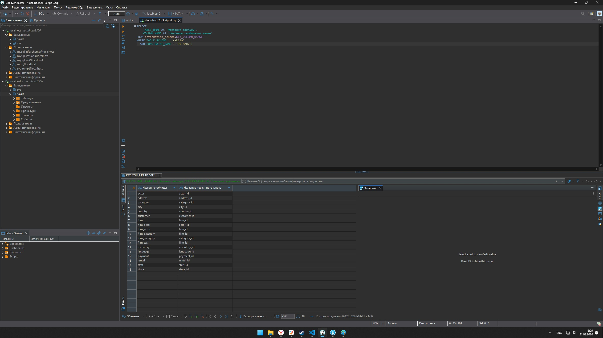

SQL-script:
```
SELECT 
    TABLE_NAME AS `Название таблицы`,
    COLUMN_NAME AS `Название первичного ключа`
FROM information_schema.KEY_COLUMN_USAGE
WHERE TABLE_SCHEMA = 'sakila'
  AND CONSTRAINT_NAME = 'PRIMARY';
```

---

### Задание 3*
3.1. Уберите у пользователя sys_temp права на внесение, изменение и удаление данных из базы sakila.

3.2. Выполните запрос на получение списка прав для пользователя sys_temp. (скриншот)

**Ответ:**

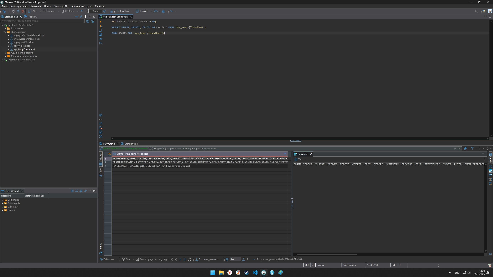
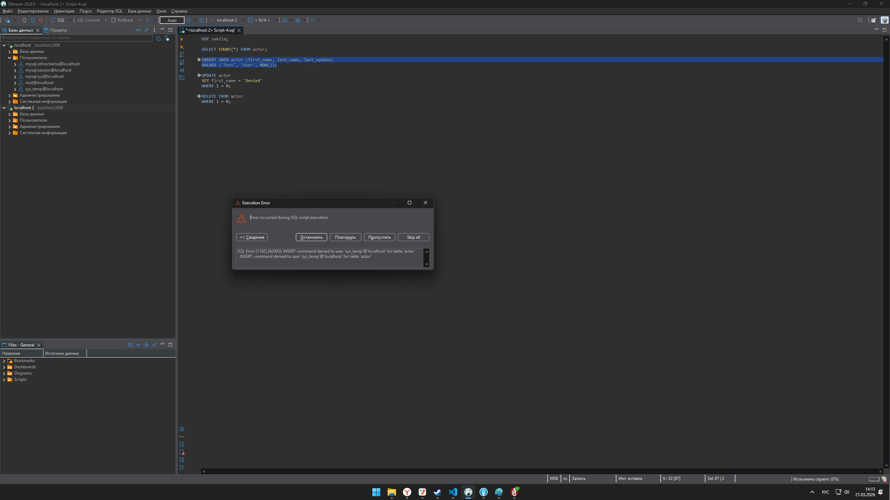

SQL-script:
```
SET PERSIST partial_revokes = ON;
REVOKE INSERT, UPDATE, DELETE ON sakila.* FROM 'sys_temp'@'localhost';
SHOW GRANTS FOR 'sys_temp'@'localhost';
```

SQL-script проверки новых прав:
```
USE sakila;

SELECT COUNT(*) FROM actor;

INSERT INTO actor (first_name, last_name, last_update)
VALUES ('Test', 'User', NOW());

UPDATE actor
SET first_name = 'Denied'
WHERE 1 = 0;

DELETE FROM actor
WHERE 1 = 0;
```