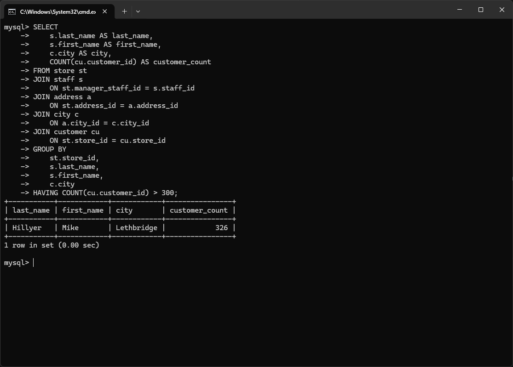
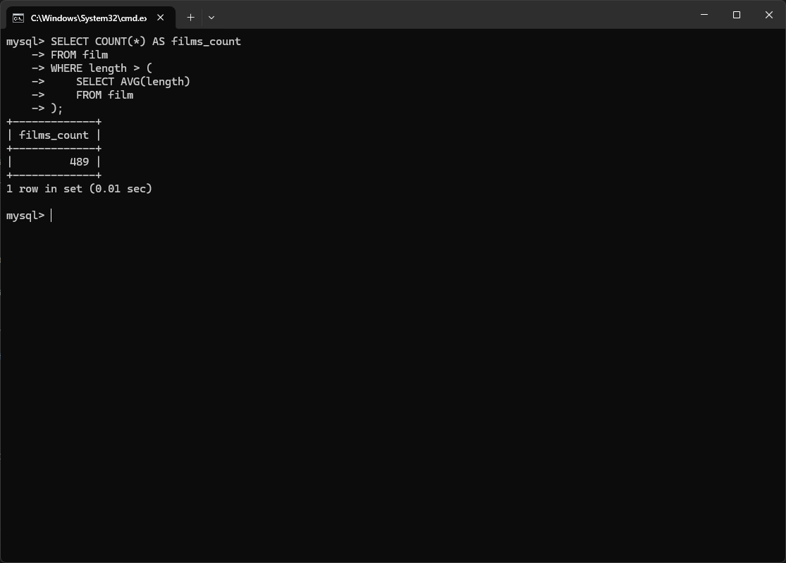
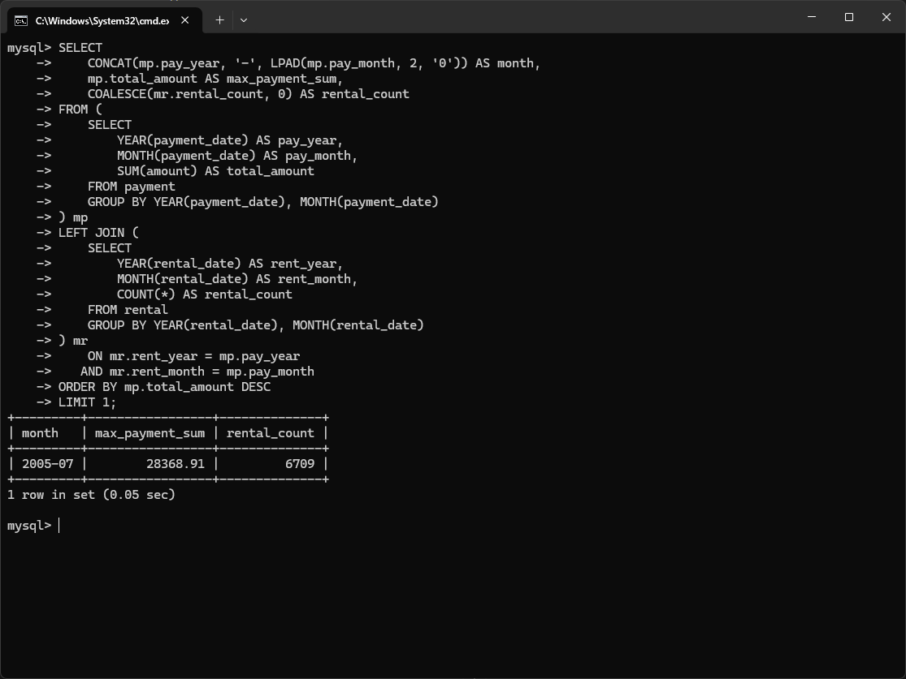
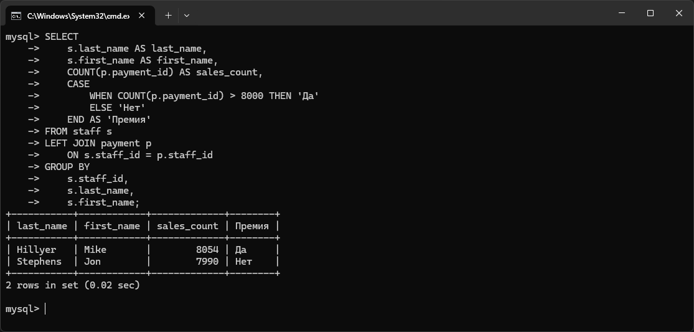
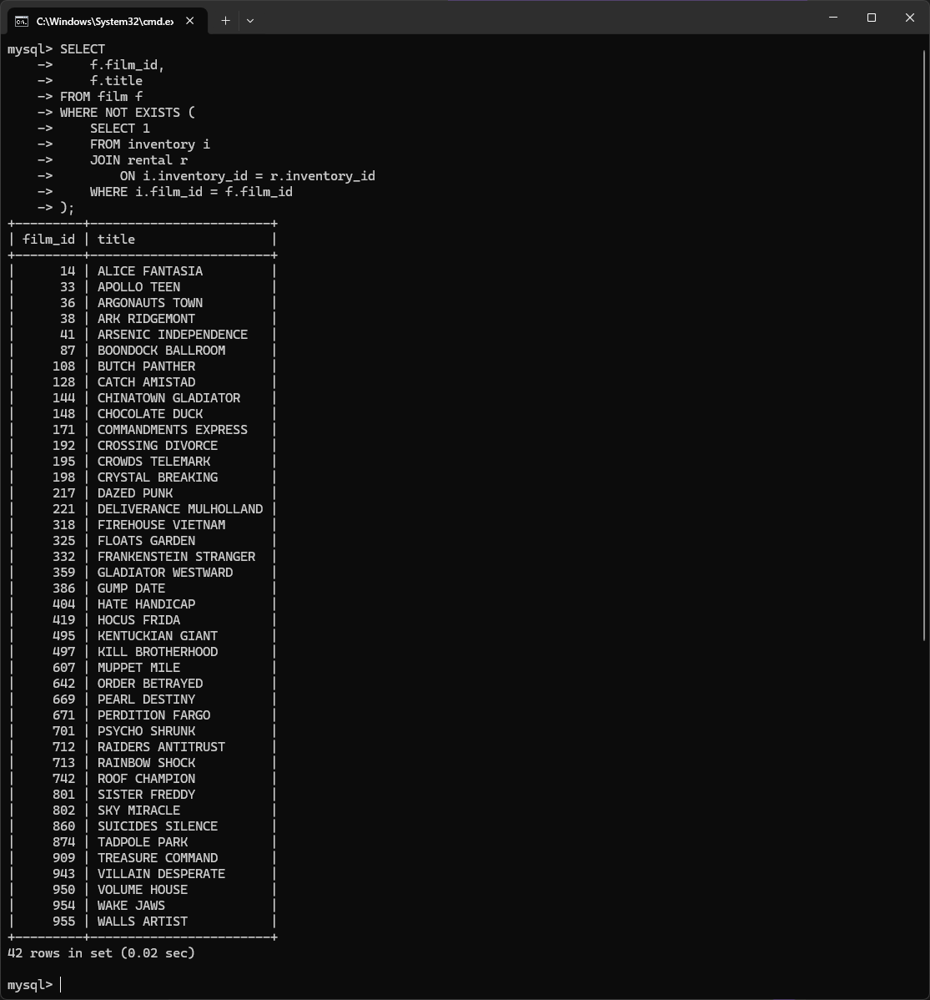

### Задание 1

Одним запросом получите информацию о магазине, в котором обслуживается более 300 покупателей, и выведите в результат следующую информацию: 
- фамилия и имя сотрудника из этого магазина;
- город нахождения магазина;
- количество пользователей, закреплённых в этом магазине.

**Ответ**



SQL-script:
```
USE sakila;
```
```
SELECT
    s.last_name AS last_name,
    s.first_name AS first_name,
    c.city AS city,
    COUNT(cu.customer_id) AS customer_count
FROM store st
JOIN staff s
    ON st.manager_staff_id = s.staff_id
JOIN address a
    ON st.address_id = a.address_id
JOIN city c
    ON a.city_id = c.city_id
JOIN customer cu
    ON st.store_id = cu.store_id
GROUP BY
    st.store_id,
    s.last_name,
    s.first_name,
    c.city
HAVING COUNT(cu.customer_id) > 300;
```

---

### Задание 2

Получите количество фильмов, продолжительность которых больше средней продолжительности всех фильмов.

**Ответ**



SQL-script:
```
SELECT COUNT(*) AS films_count
FROM film
WHERE length > (
    SELECT AVG(length)
    FROM film
);
```

---

### Задание 3

Получите информацию, за какой месяц была получена наибольшая сумма платежей, и добавьте информацию по количеству аренд за этот месяц.

**Ответ**



SQL-script:
```
SELECT
    CONCAT(mp.pay_year, '-', LPAD(mp.pay_month, 2, '0')) AS month,
    mp.total_amount AS max_payment_sum,
    COALESCE(mr.rental_count, 0) AS rental_count
FROM (
    SELECT
        YEAR(payment_date) AS pay_year,
        MONTH(payment_date) AS pay_month,
        SUM(amount) AS total_amount
    FROM payment
    GROUP BY YEAR(payment_date), MONTH(payment_date)
) mp
LEFT JOIN (
    SELECT
        YEAR(rental_date) AS rent_year,
        MONTH(rental_date) AS rent_month,
        COUNT(*) AS rental_count
    FROM rental
    GROUP BY YEAR(rental_date), MONTH(rental_date)
) mr
    ON mr.rent_year = mp.pay_year
   AND mr.rent_month = mp.pay_month
ORDER BY mp.total_amount DESC
LIMIT 1;
```

---

### Задание 4*

Посчитайте количество продаж, выполненных каждым продавцом. Добавьте вычисляемую колонку «Премия». Если количество продаж превышает 8000, то значение в колонке будет «Да», иначе должно быть значение «Нет».

**Ответ**



SQL-script:
```
SELECT
    s.last_name AS last_name,
    s.first_name AS first_name,
    COUNT(p.payment_id) AS sales_count,
    CASE
        WHEN COUNT(p.payment_id) > 8000 THEN 'Да'
        ELSE 'Нет'
    END AS 'Премия'
FROM staff s
LEFT JOIN payment p
    ON s.staff_id = p.staff_id
GROUP BY
    s.staff_id,
    s.last_name,
    s.first_name;
```

---


### Задание 5*

Найдите фильмы, которые ни разу не брали в аренду.

**Ответ**



SQL-script:
```
SELECT
    f.film_id,
    f.title
FROM film f
WHERE NOT EXISTS (
    SELECT 1
    FROM inventory i
    JOIN rental r
        ON i.inventory_id = r.inventory_id
    WHERE i.film_id = f.film_id
);
```