### Задание 1

На лекции рассматривались режимы репликации master-slave, master-master, опишите их различия.

*Ответить в свободной форме.*

**Ответ**

**Режим master-slave** — это схема, в которой есть один основной сервер (master) и один или несколько подчинённых (slave).

На master выполняются все операции изменения данных: INSERT, UPDATE, DELETE. 

Затем эти изменения записываются в журнал, а slave-серверы копируют их и применяют у себя. 

Обычно такая схема используется так: запись идёт на master, чтение можно распределить на slave. 

Это удобно для разгрузки чтения, повышения отказоустойчивости и наличия копии данных. 

Но у такой схемы есть ограничение: slave обычно не используется для полноценной записи, а данные на нём могут немного отставать от master при асинхронной репликации.

---

**Режим master-master** — это по сути двусторонняя репликация, где каждый сервер одновременно является и master, и slave. 

То есть изменения можно вносить на оба сервера, и они будут обмениваться ими между собой. 

Такая схема даёт большую гибкость и повышает доступность, потому что запись возможна не только в один узел. 

Однако она сложнее в настройке и сопровождении, так как возникает риск конфликтов данных, если одна и та же запись будет изменяться на двух серверах почти одновременно. 

Поэтому master-master обычно требует более аккуратной организации работы приложения и правил записи.

*Если кратко, то главное различие такое:*
 - **master-slave** — один сервер для записи, остальные в основном для чтения;
 - **master-master** — оба сервера могут принимать запись и синхронизируются между собой.

---

### Задание 2

Выполните конфигурацию master-slave репликации, примером можно пользоваться из лекции.

*Приложите скриншоты конфигурации, выполнения работы: состояния и режимы работы серверов.*

**Ответ**

Для выполнения задания была настроена **master-slave репликация MySQL 8.4** в Docker на Windows 11.

Были созданы два контейнера:
- `mysql-master`
- `mysql-slave`

Для `mysql-master` была включена запись бинарного лога и GTID:
- `server-id=1`
- `log-bin=mysql-bin`
- `binlog_format=ROW`
- `gtid_mode=ON`
- `enforce_gtid_consistency=ON`

Для `mysql-slave` были заданы параметры реплики:
- `server-id=2`
- `log-bin=mysql-bin`
- `relay-log=relay-bin`
- `binlog_format=ROW`
- `gtid_mode=ON`
- `enforce_gtid_consistency=ON`

На **master** был создан пользователь для репликации:

SQL - script

```
CREATE USER IF NOT EXISTS 'repl'@'%' IDENTIFIED BY 'replpass';
GRANT REPLICATION SLAVE, REPLICATION CLIENT ON *.* TO 'repl'@'%';
FLUSH PRIVILEGES;
```
Проверка контейнеров:

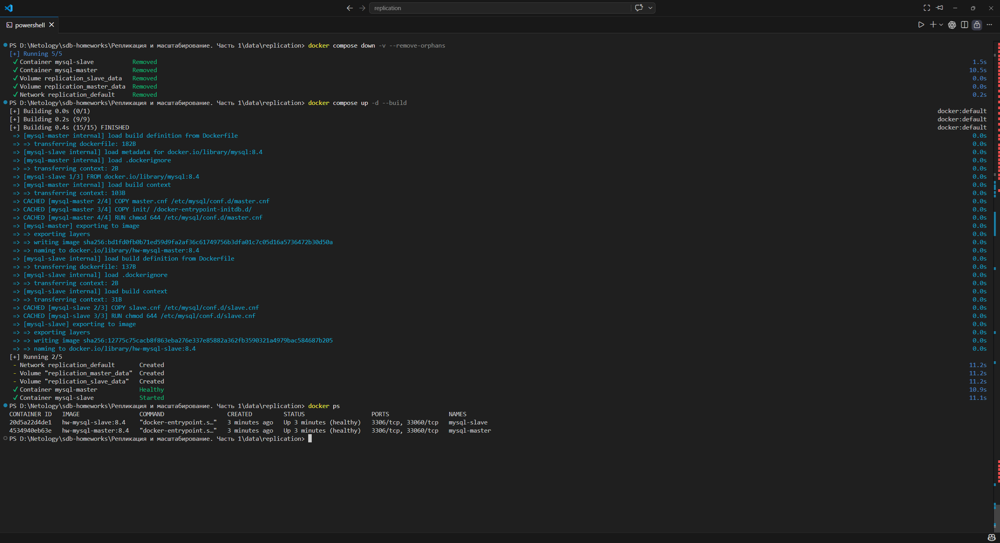

Проверка **master**:

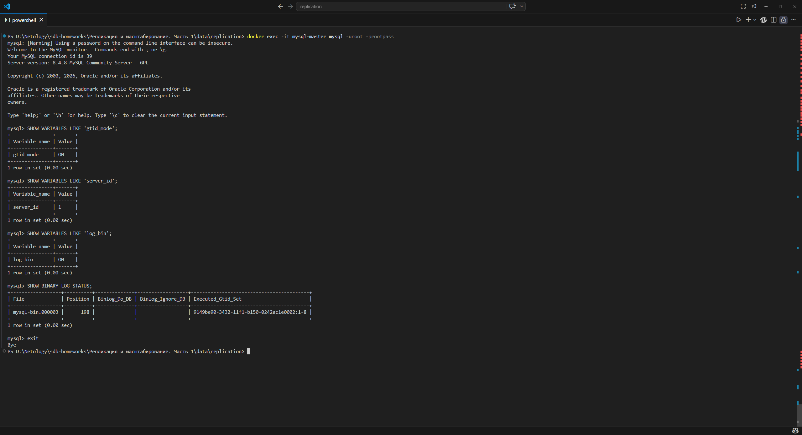

После запуска контейнеров на slave была выполнена настройка источника репликации:

SQ: - script

```
STOP REPLICA;
RESET REPLICA ALL;

CHANGE REPLICATION SOURCE TO
  SOURCE_HOST='mysql-master',
  SOURCE_PORT=3306,
  SOURCE_USER='repl',
  SOURCE_PASSWORD='replpass',
  SOURCE_AUTO_POSITION=1,
  GET_SOURCE_PUBLIC_KEY=1;

START REPLICA;
SHOW REPLICA STATUS\G
```

---

Проверка состояния репликации показала:
 - Replica_IO_Running:  Yes
 - Replica_SQL_Running: Yes

 Это означает, что slave успешно подключён к master, получает изменения и применяет их.
 
Настройка репликации на **slave**:

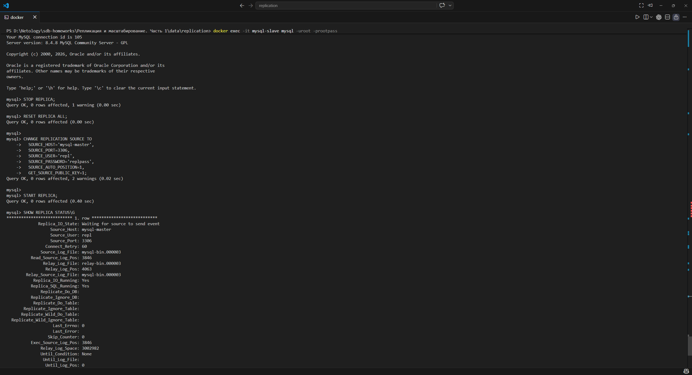
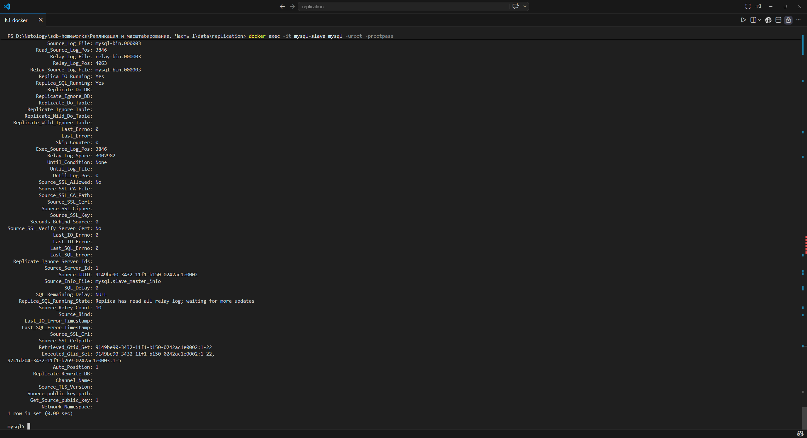

 Для проверки работы репликации на master были выполнены команды:

 SQL - script

 ```
 CREATE DATABASE netology_db;
USE netology_db;

CREATE TABLE students (
    id INT PRIMARY KEY AUTO_INCREMENT,
    name VARCHAR(100) NOT NULL
);

INSERT INTO students (name) VALUES ('test_from_master');
SELECT * FROM students;
```

Создание БД на **master**:

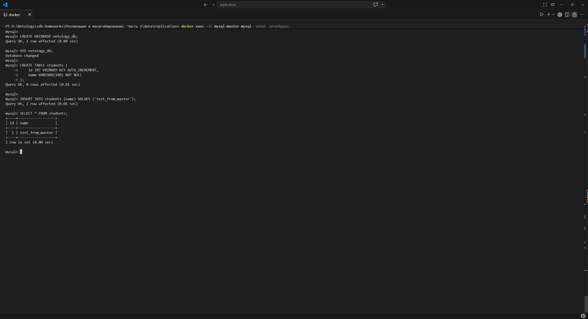

После этого на slave были выполнены команды:

SQL - script

```
SHOW DATABASES;
USE netology_db;
SELECT * FROM students;
```

Результат показал, что на slave появилась база netology_db и строка:

`test_from_master`

Данные на **slave**:

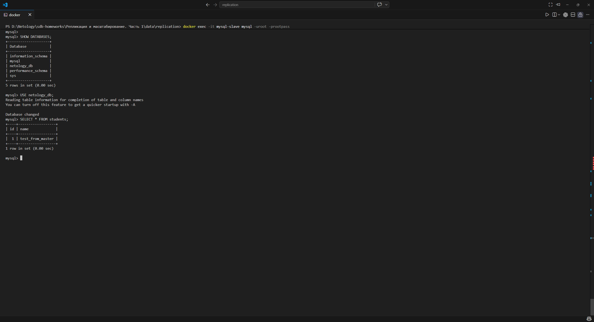

---

### Задание 3*

Выполните конфигурацию master-master репликации. Произведите проверку.

*Приложите скриншоты конфигурации, выполнения работы: состояния и режимы работы серверов.*

**Ответ** 

Для выполнения задания была настроена **master-master репликация MySQL 8.4** в Docker на Windows 11.

Были созданы два контейнера:
- `mysql-master1`
- `mysql-master2`

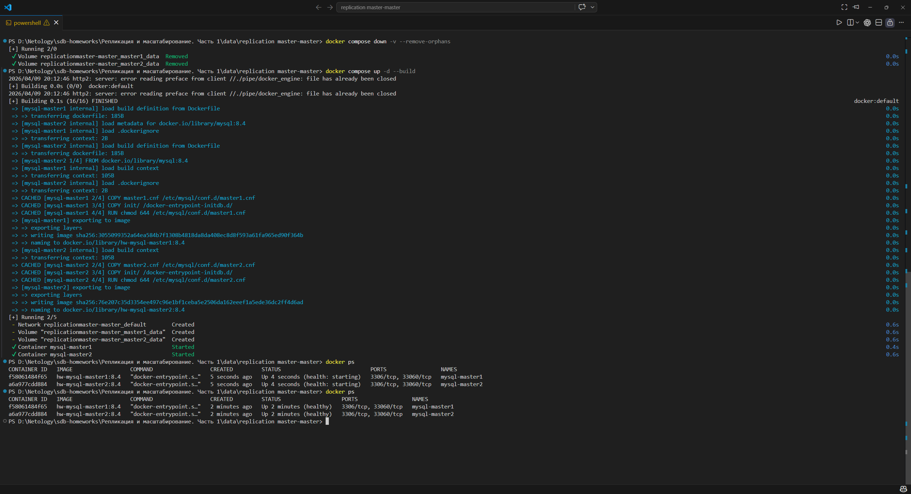

Оба узла работают одновременно как `master` и как `replica` друг для друга.

Для каждого сервера были заданы отдельные параметры:
- уникальный `server-id`;
- включён бинарный лог `log-bin`;
- установлен `binlog_format=ROW`;
- включён `gtid_mode=ON`;
- включён `enforce_gtid_consistency=ON`;
- включён `log_replica_updates=ON`.

Для уменьшения вероятности конфликтов автоинкремента использовались разные параметры генерации `id` на двух узлах.

На **mysql-master1** была настроена репликация с источником **mysql-master2**:

SQL - script:

```
STOP REPLICA;
RESET REPLICA ALL;

CHANGE REPLICATION SOURCE TO
  SOURCE_HOST='mysql-master2',
  SOURCE_PORT=3306,
  SOURCE_USER='repl2',
  SOURCE_PASSWORD='replpass2',
  SOURCE_AUTO_POSITION=1,
  GET_SOURCE_PUBLIC_KEY=1;

START REPLICA;
SHOW REPLICA STATUS\G
```

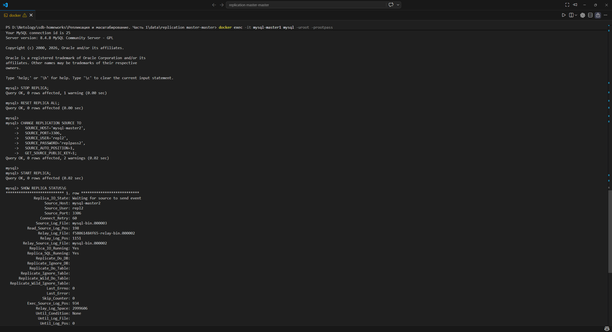
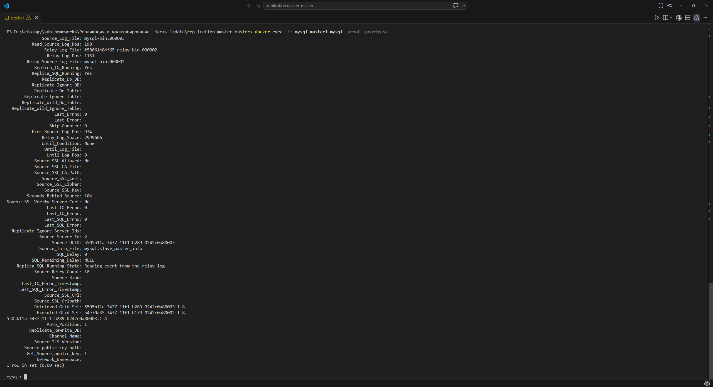

На **mysql-master2** была настроена репликация с источником **mysql-master1**:

SQL - script:

```
STOP REPLICA;
RESET REPLICA ALL;

CHANGE REPLICATION SOURCE TO
  SOURCE_HOST='mysql-master1',
  SOURCE_PORT=3306,
  SOURCE_USER='repl1',
  SOURCE_PASSWORD='replpass1',
  SOURCE_AUTO_POSITION=1,
  GET_SOURCE_PUBLIC_KEY=1;

START REPLICA;
SHOW REPLICA STATUS\G
```


Проверка статуса на обоих серверах показала:

`Replica_IO_Running:    Yes`
`Replica_SQL_Running:   Yes`

Это означает, что оба сервера успешно подключены друг к другу, получают изменения и применяют их.

Для проверки двусторонней репликации на **mysql-master1** была создана тестовая база данных и таблица:

SQL - script:

```
CREATE DATABASE netology_mm;
USE netology_mm;

CREATE TABLE students (
    id INT PRIMARY KEY AUTO_INCREMENT,
    name VARCHAR(100) NOT NULL
);

INSERT INTO students (name) VALUES ('from_master1');
SELECT * FROM students;
```

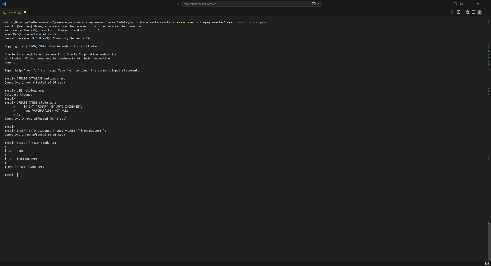

После этого на **mysql-master2** была выполнена проверка:

SQL - script:

```
SHOW DATABASES;
USE netology_mm;
SELECT * FROM students;
```

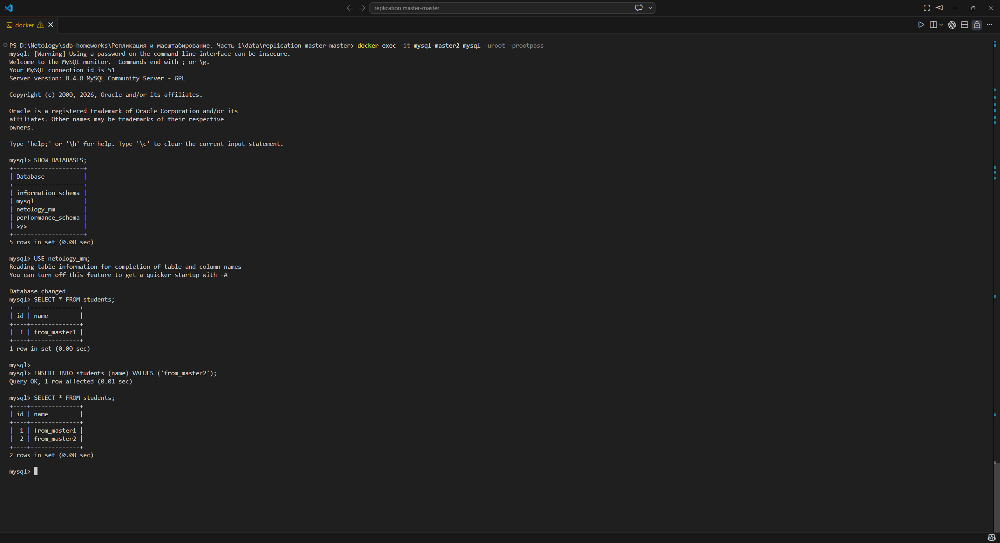

В результате на **mysql-master2** появилась база **netology_mm** и строка:

`from_master1`

Далее на **mysql-master2** была добавлена ещё одна запись:

SQL - script:

```
INSERT INTO students (name) VALUES ('from_master2');
SELECT * FROM students;
```

После этого на **mysql-master1** была выполнена повторная проверка:

SQL - script:

```
USE netology_mm;
SELECT * FROM students;
```

В результате на **mysql-master1** появились обе строки:
 - `from_master1`
 - `from_master2`

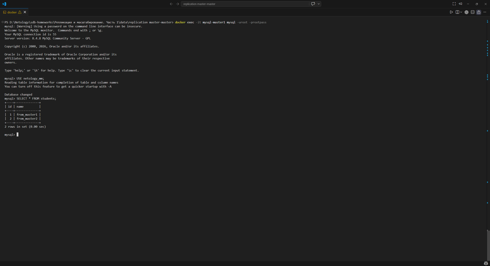

Таким образом, репликация master-master была успешно настроена и проверена: изменения, внесённые на одном сервере, передаются на второй сервер, и наоборот.