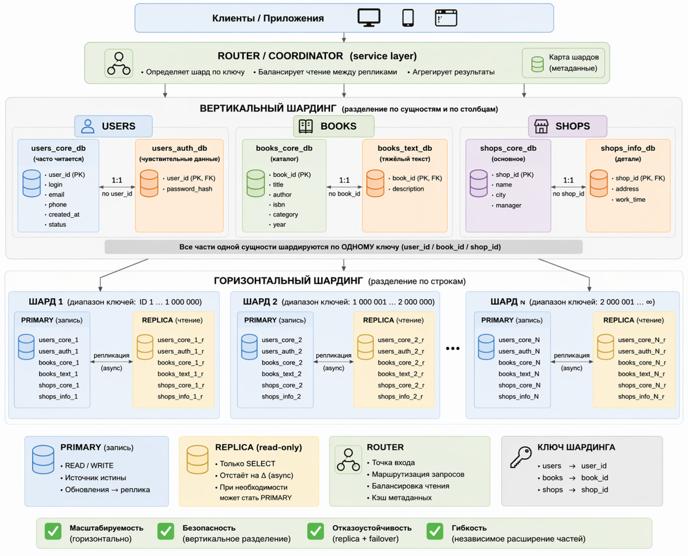
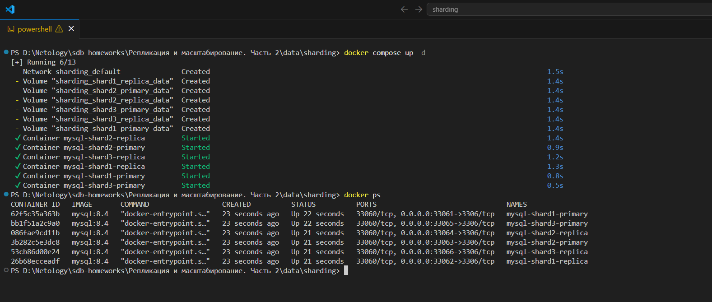
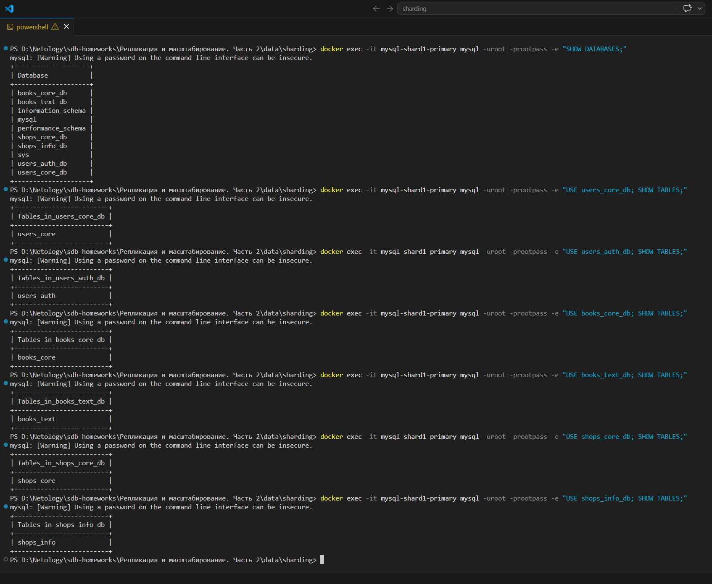
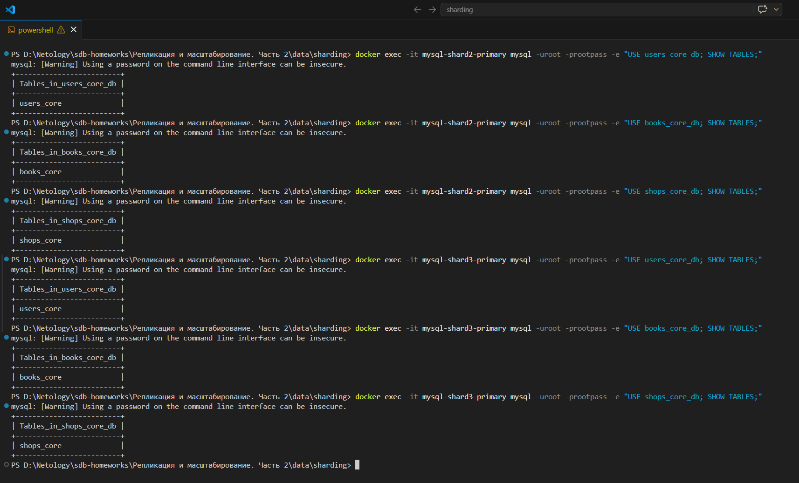
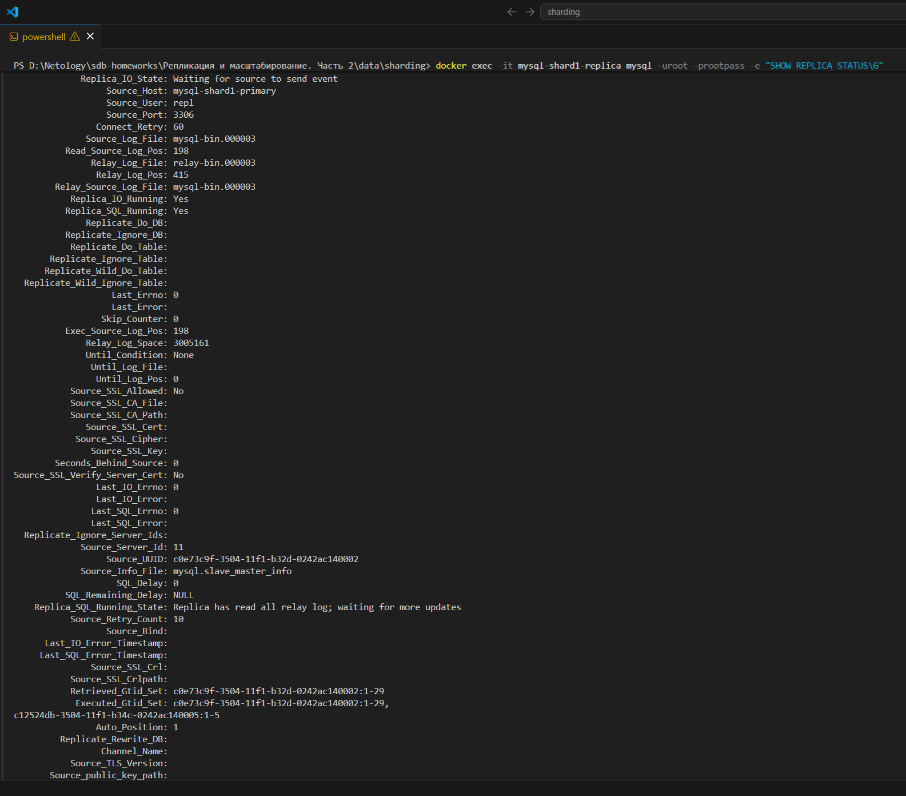
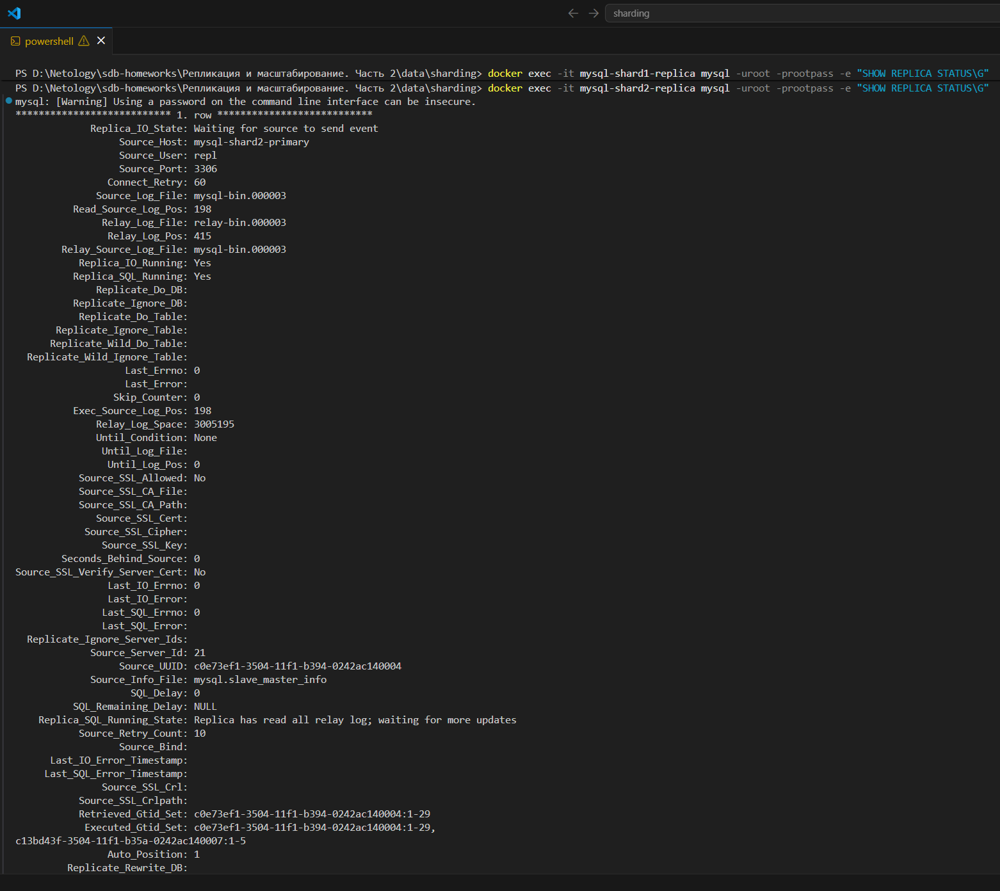
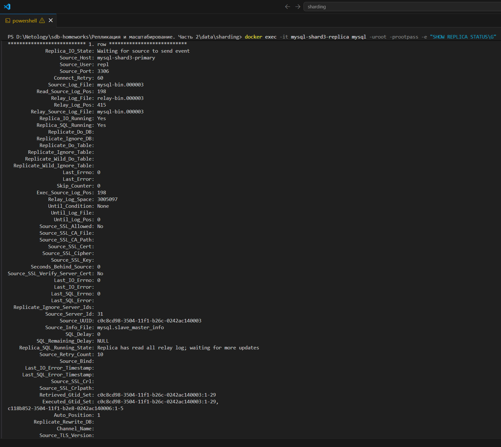
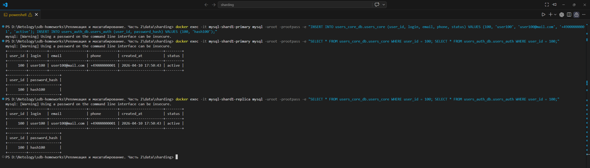
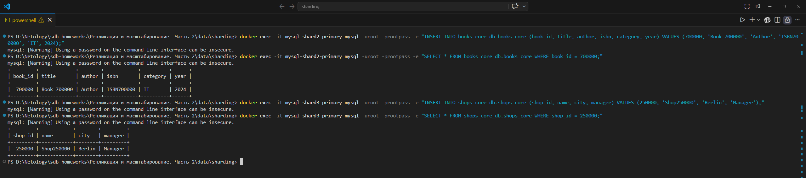

### Задание 1

Опишите основные преимущества использования масштабирования методами:

- активный master-сервер и пассивный репликационный slave-сервер; 
- master-сервер и несколько slave-серверов;

*Дайте ответ в свободной форме.*

**Ответ**

Схема **активный master и пассивный slave** полезна прежде всего для **отказоустойчивости и резервирования**.

Все изменения выполняются на основном сервере, а slave поддерживает актуальную копию данных. 

Если master выходит из строя, slave можно использовать для восстановления работы или переключения сервиса на резервный узел. 

Кроме того, такая схема удобна для резервного копирования, тестирования и выполнения части запросов на чтение без дополнительной нагрузки на основной сервер. 

Репликация в целом как раз используется в первую очередь для повышения отказоустойчивости, а также для распределения нагрузки.

---

Схема **master и несколько slave** даёт уже более заметный эффект именно в плане **масштабирования чтения**. 

Один master обрабатывает запись, а несколько slave-серверов могут параллельно обслуживать большое количество запросов на чтение. 

Это повышает производительность системы, позволяет распределять нагрузку между несколькими узлами и повышает доступность сервиса: если одна реплика недоступна, чтение можно перенаправить на другие. 

Также разные slave можно использовать для разных задач, например одну для пользовательских запросов, другую для отчётов, третью для резервных копий или аналитики. 

Кратко:
 - **master + пассивный slave** — это в первую очередь отказоустойчивость, резервирование и восстановление;
 - **master + несколько slave** — это масштабирование чтения, распределение нагрузки и повышение доступности.

---

### Задание 2

Разработайте план для выполнения горизонтального и вертикального шаринга базы данных. База данных состоит из трёх таблиц: 

- пользователи, 
- книги, 
- магазины (столбцы произвольно). 

Опишите принципы построения системы и их разграничение или разбивку между базами данных.

*Пришлите блоксхему, где и что будет располагаться. Опишите, в каких режимах будут работать сервера.* 

**Ответ**

### 1. Исходные таблицы

Для примера возьму такие поля:

**users**
`user_id, login, email, phone, password_hash, created_at, status`

**books**
`book_id, title, author, isbn, category, year, description`

**shops**
`shop_id, name, city, address, work_time, manager`

---

### 2. Вертикальный шардинг

Здесь задача — вынести в отдельные БД те данные, которые:
 - либо чувствительные,
 - либо редко читаются,
 - либо создают лишнюю нагрузку на основную таблицу.

Таблица **users**

Разделил бы так:

**users_core_db**
 - `user_id`
 - `login`
 - `email`
 - `phone`
 - `created_at`
 - `status`

**users_auth_db**
 - `user_id`
 - `password_hash`

**Почему так:**
основная информация о пользователе читается часто, а пароль — чувствительные данные, к которым доступ нужен только сервису авторизации.

---

Таблица **books**

Разделил бы так:

**books_core_db**
 - `book_id`
 - `title`
 - `author`
 - `isbn`
 - `category`
 - `year`

**books_text_db**
 - `book_id`
 - `description`

**Почему так:**
каталог книг читается часто, а длинные описания можно вынести отдельно, чтобы не перегружать основную таблицу.

---

Таблица **shops**

Разделил бы так:

**shops_core_db**
 - `shop_id`
 - `name`
 - `city`
 - `manager`

**shops_info_db**
 - `shop_id`
 - `address`
 - `work_time`

**Почему так:**
основные сведения о магазине используются чаще, чем детальная информация.

---

### 3. Горизонтальный шардинг

После вертикального деления дальше разбил бы данные по нескольким серверам.

Для **users**

Шардирование по `user_id`.

Например:
 - `shard_1` — `user_id` от 1 до 1 000 000
 - `shard_2` — `user_id` от 1 000 001 до 2 000 000
 - `shard_3` — `user_id` от 2 000 001 и выше

Одно и то же правило используется и для `users_core_db`, и для `users_auth_db`, чтобы данные одного пользователя всегда попадали в один и тот же шард.

---

Для **books**

Шардирование по `book_id`.

Например:
 - `shard_1` — `book_id` 1…500 000
 - `shard_2` — `book_id` 500 001…1 000 000
 - `shard_3` — `book_id` 1 000 001 и выше

Я бы выбрал именно `book_id`, а не категорию, потому что категории могут быть распределены неравномерно.  
Шардирование по `book_id` даёт более равномерное распределение нагрузки, чем разбиение по категориям.

---

Для **shops**

Шардирование выполню по `shop_id`.

Например:
 - `shard_1` — `shop_id` 1…100 000
 - `shard_2` — `shop_id` 100 001…200 000
 - `shard_3` — `shop_id` 200 001 и выше

---

### 4. Принципы построения системы

#### 4.1. Перед БД ставится слой маршрутизации

Приложение не должно само знать, где лежит конкретный шард.

Для этого нужен **router / service layer**, который:
 - определяет нужный шард по ключу;
 - отправляет запись в нужный `primary`;
 - отправляет чтение либо в `replica`, либо в `primary`, если нужна максимальная актуальность;
 - собирает данные из вертикально разделённых частей обратно в единый ответ.

#### 4.2. Один ключ шардинга для связанных частей

Если таблица разделена вертикально, то обе её части должны использовать один и тот же ключ шардинга.

Например:
 - `users_core` и `users_auth` — по `user_id`
 - `books_core` и `books_text` — по `book_id`
 - `shops_core` и `shops_info` — по `shop_id`

#### 4.3. Минимизировать межшардовые JOIN

Лучше, чтобы приложение или router собирали данные на уровне сервиса, а не делали сложные JOIN между разными шардами.

#### 4.4. Репликация для отказоустойчивости

У каждого шарда есть:
 - `primary` — для записи;
 - `replica` — для чтения и резервирования.

Это нужно для распределения нагрузки на чтение и для переключения в случае отказа основного узла.

### 5. Блоксхема размещения



---

### 6. В каких режимах будут работать серверы

**Primary**
 - принимает `INSERT / UPDATE / DELETE`;
 - является основным узлом для записи;
 - передаёт изменения на реплику.

**Replica**
 - работает в режиме `read-only`;
 - обслуживает `SELECT`;
 - используется как резервный узел.

**Router / coordinator**
 - работает как точка входа;
 - определяет, в какой шард отправить запрос;
 - для `users` может читать с `primary`, если важна актуальность;
 - для `books` и `shops` может читать с `replica`;
 - объединяет данные из вертикально разделённых баз данных.

---

### 7. Что в итоге получится

**Вертикальный шардинг решает:**
 - разделение чувствительных данных;
 - уменьшение размера тяжёлых таблиц;
 - независимое масштабирование разных частей системы.

**Горизонтальный шардинг решает:**
 - рост объёма данных;
 - рост количества пользователей и запросов;
 - распределение нагрузки между несколькими серверами.

---

**Вывод**

**Для этой БД я использую комбинированную схему:**
 - вертикально разделяю каждую сущность на логические части;
 - горизонтально распределяю строки по нескольким MySQL-шардам;
 - для каждого шарда использую схему `primary + replica`;
 - перед базами данных размещаю `router`, который определяет нужный шард по ключу и направляет запрос в соответствующий узел.

**Такое решение даёт:**
 - масштабируемость;
 - отказоустойчивость;
 - более безопасное хранение данных;
 - возможность независимо расширять разные части системы.

---

### Задание 3*

Выполните настройку выбранных методов шардинга из задания 2.

*Пришлите конфиг Docker и SQL скрипт с командами для базы данных*.

**Ответ** 

#### Что находится в проекте

В проекте используются только **MySQL 8.4**, **Docker** и **SQL-скрипты**.

Структура проекта:
 - `docker-compose.yml` — поднимает 6 контейнеров MySQL;
 - `sql/shard1-primary-init.sql` — инициализация первого primary-шарда;
 - `sql/shard2-primary-init.sql` — инициализация второго primary-шарда;
 - `sql/shard3-primary-init.sql` — инициализация третьего primary-шарда;
 - `sql/shard1-replica-setup.sql` — настройка репликации для replica первого шарда;
 - `sql/shard2-replica-setup.sql` — настройка репликации для replica второго шарда;
 - `sql/shard3-replica-setup.sql` — настройка репликации для replica третьего шарда.

---

#### Логика решения

##### Горизонтальный шардинг

Горизонтальный шардинг реализован через 3 отдельных MySQL-шарда:
 - `mysql-shard1-primary`
 - `mysql-shard1-replica`
 - `mysql-shard2-primary`
 - `mysql-shard2-replica`
 - `mysql-shard3-primary`
 - `mysql-shard3-replica`

Диапазоны идентификаторов распределены так:
 - `users`:
   - shard 1: `1 .. 1000000`
   - shard 2: `1000001 .. 2000000`
   - shard 3: `2000001+`

 - `books`:
   - shard 1: `1 .. 500000`
   - shard 2: `500001 .. 1000000`
   - shard 3: `1000001+`

 - `shops`:
   - shard 1: `1 .. 100000`
   - shard 2: `100001 .. 200000`
   - shard 3: `200001+`

Таким образом, данные разных диапазонов размещаются на разных серверах.

---

##### Вертикальный шардинг

Внутри каждого шарда данные разделены по отдельным базам данных:
 - `users_core_db`
 - `users_auth_db`
 - `books_core_db`
 - `books_text_db`
 - `shops_core_db`
 - `shops_info_db`

Таблицы разделены следующим образом:
 - `users_core_db.users_core` — основная информация о пользователях;
 - `users_auth_db.users_auth` — данные авторизации пользователей;
 - `books_core_db.books_core` — основные данные о книгах;
 - `books_text_db.books_text` — текстовые описания книг;
 - `shops_core_db.shops_core` — основные данные о магазинах;
 - `shops_info_db.shops_info` — дополнительная информация о магазинах.

Таким образом, выполнено вертикальное разделение данных по логическим частям.

---

##### Режимы работы серверов

Для каждого шарда используются два режима работы:

**Primary**
 - принимает `INSERT / UPDATE / DELETE`;
 - является основным сервером записи;
 - передаёт изменения на реплику.

**Replica**
 - работает в режиме чтения;
 - получает изменения с primary через репликацию;
 - используется для разгрузки чтения и отказоустойчивости.

В данной реализации маршрутизация между шардами предполагается на уровне приложения, а в рамках задания 3 настроены именно Docker-конфигурация и SQL-структура MySQL.

---

#### Порядок запуска

**1. Запустить контейнеры**

```
docker compose up -d
```

**2. Проверить, что контейнеры запущены**

```
docker ps
```

Должны быть видны контейнеры:
 - `mysql-shard1-primary`
 - `mysql-shard1-replica`
 - `mysql-shard2-primary`
 - `mysql-shard2-replica`
 - `mysql-shard3-primary`
 - `mysql-shard3-replica`



**3. Подождать 20–30 секунд, чтобы MySQL завершил инициализацию.**

**4. Выполнить настройку реплик**

**5. Проверка созданных баз данных**

```
docker exec -it mysql-shard1-primary mysql -uroot -prootpass -e "SHOW DATABASES;"
```

Должны быть базы данных:
 - `users_core_db`
 - `users_auth_db`
 - `books_core_db`
 - `books_text_db`
 - `shops_core_db`
 - `shops_info_db`

Проверка таблиц:

```
docker exec -it mysql-shard1-primary mysql -uroot -prootpass -e "USE users_core_db; SHOW TABLES;"
docker exec -it mysql-shard1-primary mysql -uroot -prootpass -e "USE users_auth_db; SHOW TABLES;"
docker exec -it mysql-shard1-primary mysql -uroot -prootpass -e "USE books_core_db; SHOW TABLES;"
docker exec -it mysql-shard1-primary mysql -uroot -prootpass -e "USE books_text_db; SHOW TABLES;"
docker exec -it mysql-shard1-primary mysql -uroot -prootpass -e "USE shops_core_db; SHOW TABLES;"
docker exec -it mysql-shard1-primary mysql -uroot -prootpass -e "USE shops_info_db; SHOW TABLES;"
```




Проверка репликации:

```
docker exec -it mysql-shard1-replica mysql -uroot -prootpass -e "SHOW REPLICA STATUS\G"
docker exec -it mysql-shard2-replica mysql -uroot -prootpass -e "SHOW REPLICA STATUS\G"
docker exec -it mysql-shard3-replica mysql -uroot -prootpass -e "SHOW REPLICA STATUS\G"
```

В корректном состоянии должны быть строки:
 - Replica_IO_Running: Yes
 - Replica_SQL_Running: Yes

Это означает, что репликация между primary и replica работает корректно.





**6. Пример проверки работы репликации**

Запись в первый primary-шард:

```
docker exec -it mysql-shard1-primary mysql -uroot -prootpass -e "INSERT INTO users_core_db.users_core (user_id, login, email, phone, status) VALUES (100, 'user100', 'user100@mail.com', '+49000000001', 'active');"
```

Проверка записи на replica:

```
docker exec -it mysql-shard1-replica mysql -uroot -prootpass -e "SELECT * FROM users_core_db.users_core WHERE user_id = 100;"
```

Если запись появилась на mysql-shard1-replica, значит репликация настроена и работает.




Все файлы проекта лежат в data/sharding/ :
 - `docker-compose.yml`
 - `sql/`
   - `shard1-primary-init.sql`
   - `shard1-replica-setup.sql`
   - `shard2-primary-init.sql`
   - `shard2-replica-setup.sql`
   - `shard3-primary-init.sql`
   - `shard3-replica-setup.sql`